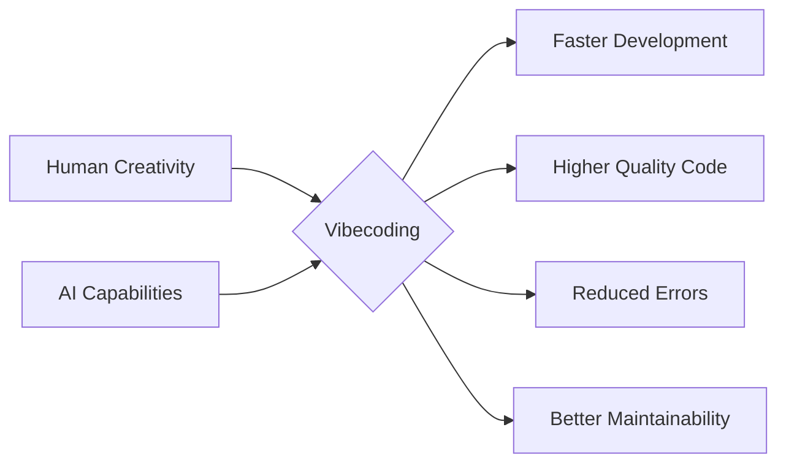

# Lesson 1: Introduction to Vibe Coding and Roocode Setup

## 🎯 Learning Objectives

By the end of this lesson, you will be able to:

- Understand what Vibecoding is and its benefits
- Set up your development environment with Roocode
- Create your first AI-assisted coding project
- Navigate the Roocode interface effectively
- Begin the LearningPathAI progressive project

## 📚 Lesson Content

### 1. What is Vibecoding?

Vibecoding is a revolutionary approach to software development that combines human creativity with AI capabilities. It enables you to:

- Write code faster and more efficiently
- Generate high-quality, maintainable code
- Debug and refactor with AI assistance
- Build complex systems with confidence



### 2. Why Vibecoding is Superior

Traditional coding approaches have limitations:

- Manual coding is time-consuming
- Human error is inevitable
- Knowledge gaps can slow development
- Maintenance can be challenging

Vibecoding addresses these challenges by:

- Leveraging AI for faster development
- Reducing human error through AI assistance
- Providing instant access to best practices
- Automating repetitive tasks

### 3. Introduction to Roocode

Roocode is a powerful AI coding assistant that helps you:

- Generate code from natural language
- Understand complex codebases
- Debug and optimize code
- Maintain code quality


### 4. Installation and Setup

#### Prerequisites

1. Visual Studio Code
2. Git
3. Node.js (for web development)
4. Python (for backend development)

#### Installing Roocode

1. Open VS Code
2. Go to Extensions (Ctrl+Shift+X)
3. Search for "Roocode"
4. Click Install

#### Configuration

1. Set up API access:
   ```bash
   # Configure OpenRouter API
   export OPENROUTER_API_KEY=your_api_key
   ```

2. Configure VS Code settings:
   ```json
   {
     "roocode.apiKey": "your_api_key",
     "roocode.model": "gpt-4",
     "roocode.temperature": 0.7
   }
   ```

### 5. First Roocode Prompt

Let's create a simple "Welcome" component for our LearningPathAI project:

**Step 1: Create Initial Component**

```jsx
// components/Welcome.jsx
import React from 'react';

const Welcome = () => {
  return (
    <div>
      <h1>Welcome to LearningPathAI</h1>
      <p>Your personalized learning journey begins here.</p>
    </div>
  );
};

export default Welcome;
```

**Step 2: Use Roocode to Enhance It**

Prompt to Roocode:
```
Enhance this Welcome component to include:
1. Current date and time display
2. A brief explanation of LearningPathAI
3. A call-to-action button
4. Proper styling with Tailwind CSS
```

**Step 3: Enhanced Component**

```jsx
// components/Welcome.jsx
import React, { useState, useEffect } from 'react';

const Welcome = () => {
  const [currentTime, setCurrentTime] = useState(new Date());
  
  // Update time every minute
  useEffect(() => {
    const timer = setInterval(() => setCurrentTime(new Date()), 60000);
    return () => clearInterval(timer);
  }, []);
  
  // Format date and time
  const formattedTime = currentTime.toLocaleTimeString();
  const formattedDate = currentTime.toLocaleDateString(undefined, {
    weekday: 'long',
    year: 'numeric',
    month: 'long',
    day: 'numeric'
  });
  
  return (
    <div className="max-w-3xl mx-auto my-12 p-8 bg-white rounded-lg shadow-md">
      <div className="text-right text-gray-500 text-sm mb-4">
        {formattedDate} | {formattedTime}
      </div>
      
      <h1 className="text-3xl font-bold text-indigo-700 mb-4">
        Welcome to LearningPathAI
      </h1>
      
      <div className="bg-indigo-50 p-6 rounded-lg mb-6">
        <h2 className="text-xl font-semibold text-indigo-800 mb-2">
          What is LearningPathAI?
        </h2>
        <p className="text-gray-700 mb-3">
          LearningPathAI is an intelligent platform that creates personalized learning
          paths based on your goals, current knowledge, and preferred learning style.
        </p>
        <p className="text-gray-700">
          Using advanced AI, we analyze your needs and create a customized
          educational journey with carefully selected resources and step-by-step guidance.
        </p>
      </div>
      
      <button className="bg-indigo-600 hover:bg-indigo-700 text-white font-bold py-3 px-6 rounded-lg transition duration-300 w-full md:w-auto">
        Start Your Learning Journey
      </button>
    </div>
  );
};

export default Welcome;
```

### 6. Navigating the Interface

Key Roocode features:

- Command palette (Ctrl+Shift+P)
- AI chat panel
- Code generation
- Documentation lookup
- Error analysis

### 7. Model Selection and Configuration

Available models:

- GPT-4 (recommended)
- GPT-3.5 Turbo
- Claude
- CodeLlama

Configuration options:

- Temperature
- Max tokens
- Context window
- Response format

### 8. Best Practices for Initial Prompts

Tips for effective prompting:

1. Be specific and clear
2. Provide context
3. Break down complex tasks
4. Use examples
5. Iterate and refine

**Example: Ineffective vs. Effective Prompts**

❌ **Ineffective Prompt**: 
```
Make a web app
```

✅ **Effective Prompt**:
```
Create a React component for a user profile card that:
1. Displays user name, avatar, and bio
2. Shows follower count with an icon
3. Has a "Follow" button that toggles state
4. Uses Tailwind CSS for styling
5. Handles loading and error states
```

### 9. Common Setup Issues

Troubleshooting guide:

1. API key issues
2. Model availability
3. Extension conflicts
4. Performance problems
5. Network connectivity

## 🚧 Progressive Project: LearningPathAI

In this course, you'll build a complete project called **LearningPathAI** - an intelligent platform that creates personalized learning paths for users based on their goals and knowledge level.

### Getting Started with LearningPathAI

**Step 1: Project Setup**

Create project directories for frontend and backend:

```bash
# Create main project directory
mkdir learningpath-ai
cd learningpath-ai

# Create frontend and backend directories
mkdir frontend backend
```

**Step 2: Initialize Git Repository**

```bash
git init
```

**Step 3: Create Initial README**

Use Roocode to help create a comprehensive README:

Prompt to Roocode:
```
Create a README.md file for a project called LearningPathAI, which is an
intelligent platform that creates personalized learning paths for users based on
their goals and current knowledge. The application will use React/Next.js for the
frontend, FastAPI for the backend, and integrate with LLMs and Perplexity search.
Include sections for project overview, features, tech stack, and setup instructions.
```

**Step 4: Project Structure**

Use Roocode to help design the initial project structure:

Prompt to Roocode:
```
Create a high-level directory structure for a full-stack application with:
1. A Next.js frontend with React and Tailwind CSS
2. A FastAPI backend with Pydantic models
3. OpenAI and Perplexity API integrations
4. PostgreSQL database integration (to be added later)

Include directories for components, API routes, services, and configuration files.
```

## 🎯 Practice Exercises

1. **Setup Verification**
   - Install Roocode
   - Configure API access
   - Test basic functionality

2. **First Prompt Challenge**
   - Create a simple calculator function that adds two numbers
   - Use Roocode to enhance it to support all basic operations (add, subtract, multiply, divide)
   - Add input validation and error handling

3. **Interface Exploration**
   - Navigate all Roocode features
   - Try at least 5 different commands
   - Customize 3 settings and document their effects

4. **LearningPathAI Project Initialization**
   - Complete all steps in the Progressive Project section
   - Extend the README with your own project vision
   - Create a .gitignore file appropriate for Next.js and FastAPI projects

## 📝 Lesson Summary

Key takeaways:

- Vibecoding combines human creativity with AI to accelerate development
- Roocode provides a powerful interface for AI-assisted coding
- Proper setup and configuration ensure optimal results
- Effective prompting is the key to getting high-quality AI responses
- The LearningPathAI project will provide hands-on experience throughout the course

## 🚀 Next Steps

1. Complete all practice exercises
2. Experiment with different prompting styles
3. Review the LearningPathAI project structure
4. Prepare for Lesson 2: Effective Prompting and Specification Writing

## 📚 Additional Resources

- [Roocode Documentation](https://roocode.com/docs)
- [VS Code Setup Guide](https://code.visualstudio.com/docs)
- [API Configuration Guide](https://roocode.com/api)
- [Community Forum](https://community.roocode.com)
- [Prompt Engineering Guide](resources/cheatsheets.md#prompt-engineering) 