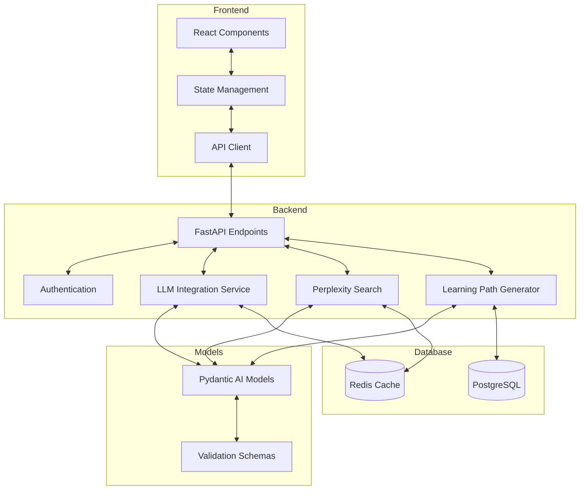

# LearningPathAI Project Implementation Plan

## 📊 Overview

This document outlines the complete plan for replacing the current progressive projects (DevConnect and Task Management Application) with a unified **LearningPathAI** project. This new project will serve as the central practice application that students build throughout the course to apply Vibecoding techniques with Roocode.

## 🎯 Project Definition

**LearningPathAI** is an intelligent platform that creates personalized learning paths for users based on their existing knowledge, goals, and preferred learning style. 

### Core Features

1. **User Assessment**: Analyze the learner's current knowledge level and learning objectives
2. **Path Generation**: Create customized learning paths with sequential topics and resources
3. **LLM Integration**: Use large language models to explain complex topics at the appropriate level
4. **Content Discovery**: Integrate with Perplexity search API to find relevant learning resources
5. **Progress Tracking**: Monitor advancement and adapt the learning path accordingly
6. **Interactive Assessments**: Offer quizzes and exercises to validate learning

### Technology Stack

- **Frontend**: React with TypeScript, Next.js
- **Backend**: Python with FastAPI
- **Data Modeling**: Pydantic AI for validation and LLM integration
- **Database**: PostgreSQL with SQLAlchemy
- **External APIs**: OpenAI API, Perplexity Search API
- **Deployment**: Docker, GitHub Actions

## 🔄 Project Architecture

## 📈 Project Evolution By Lesson

### Lesson 1: Introduction to Vibe Coding and Roocode Setup

**Project Stage:** Initial Setup and Environment Configuration

**What Students Build:**
- Set up development environments for React and FastAPI
- Create project repository with proper structure
- Scaffold basic application components
- Configure essential libraries and dependencies

**Key Vibecoding Techniques:**
- Using Roocode to generate project scaffolding
- Creating initial configuration files with AI assistance
- Setting up proper directory structures based on AI recommendations

**Deliverables:**
- Project repository with proper structure
- Basic Next.js application
- FastAPI backend skeleton
- Environment configuration

### Lesson 2: Effective Prompting and Specification Writing

**Project Stage:** Requirements and API Specifications

**What Students Build:**
- Detailed project requirements document
- API specifications for learning path generation
- User story definitions and acceptance criteria
- Data model specifications for the application

**Key Vibecoding Techniques:**
- Generating comprehensive specifications with AI
- Creating well-structured API documentation
- Designing data models with AI assistance
- Translating user needs into technical requirements

**Deliverables:**
- Complete API specification document
- Database schema design
- User stories in GitHub issues
- Wireframes for key application screens

### Lesson 3: Basic Code Generation and Editing

**Project Stage:** Core UI Components and API Routes

**What Students Build:**
- Basic React components for the user interface
- FastAPI route definitions
- Data models using Pydantic
- Frontend-backend integration foundations

**Key Vibecoding Techniques:**
- Generating React components with AI
- Creating FastAPI routes with proper validation
- Building Pydantic models for data validation
- Editing AI-generated code for specific requirements

**Deliverables:**
- User registration and profile components
- Learning goals input interface
- Basic API endpoints for user management
- Integration between frontend and backend

### Lesson 4: Iterative Development and Workflow

**Project Stage:** LLM Integration and Core Functionality

**What Students Build:**
- LLM integration for learning path generation
- User knowledge assessment system
- Topic sequencing algorithms
- Basic learning path visualization

**Key Vibecoding Techniques:**
- Iterative enhancement of features
- Implementing complex algorithms with AI assistance
- Refining code through multiple prompt-edit cycles
- Managing API integrations with AI guidance

**Deliverables:**
- Working LLM integration with OpenAI API
- Knowledge assessment questionnaire
- Initial learning path generation functionality
- Topic sequencing and prerequisite mapping

### Lesson 5: Debugging and Error Handling with AI

**Project Stage:** Robust Error Management

**What Students Build:**
- Comprehensive error handling for LLM responses
- Input validation for user submissions
- Error recovery mechanisms
- User-friendly error messaging

**Key Vibecoding Techniques:**
- Using AI to identify potential error cases
- Generating error handling code
- Debugging LLM integration issues
- Creating robust validation logic

**Deliverables:**
- Global error handling system
- Form validation throughout the application
- LLM response validation and fallback mechanisms
- Error logging and monitoring system

### Lesson 6: Refactoring and Optimization

**Project Stage:** Performance Improvements and Code Quality

**What Students Build:**
- Optimized React components for better performance
- Efficient API endpoint implementation
- Improved data handling
- Better state management in frontend

**Key Vibecoding Techniques:**
- Using AI for code refactoring
- Identifying performance bottlenecks with AI assistance
- Implementing optimization patterns
- Restructuring code for better maintainability

**Deliverables:**
- Optimized frontend components
- More efficient API calls
- Improved state management
- Better code organization

### Lesson 7: Advanced Roocode Features

**Project Stage:** Perplexity Search Integration

**What Students Build:**
- Perplexity search API integration
- Content recommendation system
- Resource filtering and ranking
- Content metadata extraction

**Key Vibecoding Techniques:**
- Using specialized modes for different development tasks
- Creating custom prompt templates for specific features
- Generating advanced API integration code
- Implementing complex search algorithms

**Deliverables:**
- Working Perplexity search integration
- Resource recommendation system
- Content relevance ranking
- Learning resource metadata extraction

### Lesson 8: Testing and Quality Assurance

**Project Stage:** Comprehensive Testing

**What Students Build:**
- Unit tests for React components
- API endpoint tests for FastAPI
- Integration tests for LLM functionality
- End-to-end tests for critical user flows

**Key Vibecoding Techniques:**
- Generating test cases with AI
- Implementing test-driven development
- Creating comprehensive test coverage
- Using AI to identify edge cases

**Deliverables:**
- Frontend test suite with Jest
- Backend tests with Pytest
- Integration tests for LLM and search functionality
- GitHub Actions CI configuration

### Lesson 9: Project Deployment and Automation

**Project Stage:** Data Persistence and Deployment

**What Students Build:**
- Database integration with PostgreSQL
- User data storage and retrieval
- Learning progress tracking
- Deployment pipeline configuration

**Key Vibecoding Techniques:**
- Creating database models with AI assistance
- Generating migration scripts
- Implementing deployment configurations
- Setting up CI/CD pipelines

**Deliverables:**
- Complete database integration
- User progress tracking functionality
- Dockerized application
- Deployment configuration for development and production

### Lesson 10: Capstone Project & Best Practices

**Project Stage:** Final Enhancements and Project Completion

**What Students Build:**
- Interactive learning assessments
- Advanced user dashboard
- Performance analytics
- Final UI/UX improvements

**Key Vibecoding Techniques:**
- Applying all previously learned techniques
- Using AI for documentation generation
- Implementing advanced features efficiently
- Creating comprehensive project documentation

**Deliverables:**
- Complete learning path application
- Interactive assessments feature
- User dashboard with analytics
- Comprehensive documentation

## 🛠️ Implementation Strategy

The implementation of this new project focus will be carried out in four distinct phases:

### Phase 1: Content Restructuring (Weeks 1-2)

**Objectives:**
- Update all project documentation to focus on LearningPathAI
- Revise lesson outlines to incorporate the new project focus
- Remove redundant content and outdated project references
- Create new architectural diagrams and project specifications

**Key Tasks:**
- Update progressive_project.md with new LearningPathAI details
- Revise progressive_project_guide.md to reflect the new project structure
- Update all lesson files to reference the new project
- Create new visual elements for architecture and workflows

### Phase 2: Content Enhancement (Weeks 3-5)

**Objectives:**
- Add technology-specific content for FastAPI, React, Pydantic AI, LLMs
- Create detailed examples for each project stage
- Develop sample prompts specific to each lesson's focus
- Enhance code examples to demonstrate Vibecoding techniques

**Key Tasks:**
- Develop detailed code examples for each lesson
- Create prompt/response examples for key features
- Update practical examples to focus on LearningPathAI components
- Enhance visual aids to illustrate complex concepts

### Phase 3: Resource Development (Weeks 6-7)

**Objectives:**
- Update all resource links and references
- Create technology-specific cheat sheets
- Develop sample code repositories
- Create comprehensive exercises for each lesson

**Key Tasks:**
- Update resources.md with relevant links
- Create technology-specific cheat sheets
- Develop sample code snippets for key features
- Create progressive exercises that build on each other

### Phase 4: Final Review (Week 8)

**Objectives:**
- Ensure consistency across all lessons
- Verify technical accuracy of all content
- Test all code examples
- Validate the project progression logic

**Key Tasks:**
- Review all content for consistency
- Test all code examples and confirm they work
- Validate that lessons build logically on each other
- Ensure all Vibecoding techniques are properly demonstrated

## 📋 Specific Files to Update

1. **Progressive Project Documentation:**
   - docs/memory_bank/progressive_project.md
   - docs/memory_bank/progressive_project_guide.md

2. **Lesson Content:**
   - docs/lessons/lesson1.md through docs/lessons/lesson10.md

3. **Resources:**
   - docs/resources/exercises.md
   - docs/resources/sample-code.md
   - docs/resources/cheatsheets.md
   - docs/resources/quizzes.md

4. **Navigation:**
   - mkdocs.yml (ensure all updated content is properly linked)

## 📊 Success Metrics

The success of this course refinement will be measured by:

1. **Consistency**: Elimination of project inconsistencies across lessons
2. **Relevance**: Integration of modern technologies that are in high demand
3. **Progression**: Logical build-up of the project across all 10 lessons
4. **Practicality**: Practical application of Vibecoding techniques to real-world problems
5. **Engagement**: Creation of a compelling project that motivates students

## 📈 Expected Outcomes

After implementing these improvements, users will experience:

1. **Enhanced Learning Experience**: A consistent, well-structured course with a compelling practice project
2. **Better Knowledge Application**: Clear examples of how to apply Vibecoding techniques to modern technologies
3. **Practical Skills Development**: Experience building a complete AI-powered application from start to finish
4. **Modern Technology Exposure**: Hands-on experience with cutting-edge tools like Pydantic AI and Perplexity Search
5. **Portfolio Development**: Completion of a showcase project that demonstrates multiple valuable skills

## 🚀 Next Steps

1. Begin implementation of Phase 1 (Content Restructuring)
2. Create a detailed schedule for all phases
3. Assign resources to specific tasks
4. Establish check-in points to monitor progress and make adjustments as needed