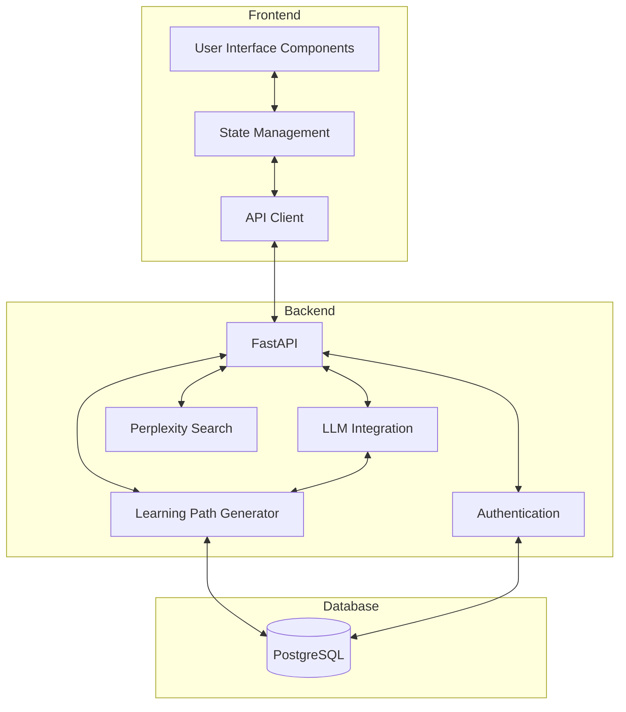
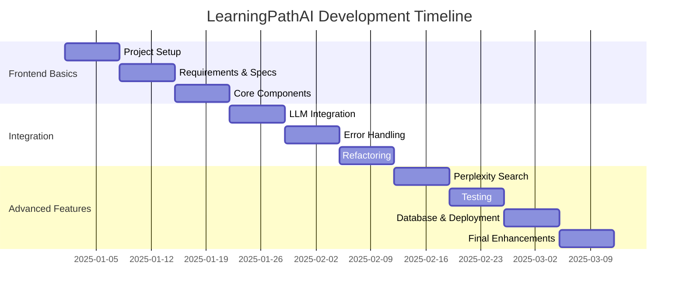

# Progressive Project Guide: LearningPathAI Application

This guide outlines a progressive project that spans all 10 lessons of the Vibecoding with Roocode course. By working on a continuous project throughout the course, students will see how concepts build upon each other and experience the complete development process from initial concept to deployment.

## 🎯 Project Overview

We'll build a **LearningPathAI Application** that grows in complexity and features as students progress through the lessons. This application will:

- Start with simple functionality that beginners can understand
- Progressively incorporate more advanced features
- Demonstrate practical application of concepts from each lesson
- Result in a complete, production-ready application
- Provide a portfolio piece for students

## 📝 Project Evolution By Lesson

### Lesson 1: Introduction to Vibe Coding and Roocode Setup

**Project Stage:** Project Setup and Basic Structure

**What Students Build:**
- Create project repository and initial structure
- Set up development environment
- Configure Next.js and FastAPI applications
- Implement a basic UI with placeholder elements

**Key Techniques:**
- Environment setup
- Basic prompting for project structure
- Using Roocode to generate configuration files
- First interaction with Roocode for code scaffolding

**Deliverable:**
A basic project scaffold with placeholder components that students will build upon in future lessons.

---

### Lesson 2: Effective Prompting and Specification Writing

**Project Stage:** Requirements and Specifications

**What Students Build:**
- Create comprehensive requirements document
- Design the application architecture
- Define data models for users and learning paths
- Create user stories and acceptance criteria

**Key Techniques:**
- Writing effective specifications with AI assistance
- Translating user needs into technical requirements
- Using AI to help plan architecture
- Creating clear, testable requirements

**Deliverable:**
A complete specification document for the LearningPathAI application, including wireframes, data models, and user stories.

---

### Lesson 3: Basic Code Generation and Editing

**Project Stage:** Core UI Components

**What Students Build:**
- Implement basic user profile functionality
- Create learning goals input components
- Implement navigation and layout structure
- Build a simple React state management approach

**Key Techniques:**
- Generating functional components with AI
- Editing AI-generated code
- Building interactive UI elements
- Implementing basic validation

**Deliverable:**
A functioning frontend with user profile, learning goals input, and navigation components using client-side state management.

---

### Lesson 4: Iterative Development and Workflow

**Project Stage:** LLM Integration

**What Students Build:**
- Implement OpenAI API integration
- Create Pydantic models for data handling
- Develop knowledge assessment system
- Build learning path generation algorithms

**Key Techniques:**
- Iterative feature development
- Refining AI integration code
- Managing development cycles
- Building upon previously generated code

**Deliverable:**
A functioning LLM integration that can assess knowledge levels and generate basic learning paths based on user goals.

---

### Lesson 5: Debugging and Error Handling with AI

**Project Stage:** Robustness and Error Management

**What Students Build:**
- Implement comprehensive error handling for LLM responses
- Add input validation throughout the application
- Create user-friendly error messages
- Implement fallback mechanisms when APIs fail

**Key Techniques:**
- Using AI to identify potential errors
- Generating error handling code
- Debugging with AI assistance
- Creating robust validation logic

**Deliverable:**
A more robust application with proper error handling, validation, and resilience against API failures.

---

### Lesson 6: Refactoring and Optimization

**Project Stage:** Code Quality Improvement

**What Students Build:**
- Refactor existing components for better structure
- Optimize performance of LLM integrations
- Improve code organization
- Enhance component reusability

**Key Techniques:**
- Using AI for code refactoring
- Identifying optimization opportunities
- Improving code quality
- Applying design patterns

**Deliverable:**
A cleaner, more efficient codebase with improved performance and maintainability.

---

### Lesson 7: Advanced Roocode Features

**Project Stage:** Perplexity Search Integration

**What Students Build:**
- Implement Perplexity search API integration
- Create content recommendation system
- Develop resource filtering mechanisms
- Build metadata extraction service

**Key Techniques:**
- Using specialized Roocode modes for complex features
- Combining multiple AI prompts for advanced functionality
- Creating sophisticated API integrations
- Implementing search algorithms

**Deliverable:**
An enhanced application with the ability to find and recommend relevant learning resources based on the user's learning path.

---

### Lesson 8: Testing and Quality Assurance

**Project Stage:** Testing Implementation

**What Students Build:**
- Create unit tests for core functionality
- Implement integration tests for API services
- Add end-to-end testing
- Set up continuous integration

**Key Techniques:**
- Using AI to generate tests
- Implementing test-driven development
- Creating comprehensive test coverage
- Automating testing processes

**Deliverable:**
A well-tested application with automated tests covering critical functionality.

---

### Lesson 9: Project Deployment and Automation

**Project Stage:** Data Persistence and Deployment

**What Students Build:**
- Implement PostgreSQL database integration
- Set up JWT authentication
- Create deployment pipeline
- Configure hosting environment

**Key Techniques:**
- Using AI to generate database models and queries
- Implementing authentication flows
- Creating deployment scripts with Docker
- Setting up automated deployment

**Deliverable:**
A fully functional application with PostgreSQL persistence, user authentication, and automated deployment.

---

### Lesson 10: Capstone Project & Best Practices

**Project Stage:** Final Enhancements and Completion

**What Students Build:**
- Add interactive assessments
- Implement user dashboard with analytics
- Create mobile-responsive design
- Add final polish and documentation

**Key Techniques:**
- Applying all previous lessons
- Using AI for documentation
- Implementing advanced features
- Creating comprehensive project documentation

**Deliverable:**
A complete, production-ready LearningPathAI application that demonstrates all concepts learned throughout the course.

## 🧩 Project Architecture

The LearningPathAI Application will follow this overall architecture:



### Technology Stack

As students progress through the course, they'll build the application using these technologies:

- **Frontend:**
  - React with Next.js
  - Tailwind CSS for styling
  - React Context API for state management
  - React Query for data fetching

- **Backend:**
  - Python with FastAPI
  - Pydantic for data validation
  - JWT for authentication
  - OpenAI API for LLM integration
  - Perplexity Search API for content discovery

- **Database:**
  - Initially in-memory storage
  - Later, SQLAlchemy with PostgreSQL for persistence

- **Testing:**
  - Jest for frontend tests
  - Pytest for backend tests
  - React Testing Library for component tests
  - Cypress for end-to-end tests

- **Deployment:**
  - GitHub Actions for CI/CD
  - Docker for containerization
  - Cloud deployment options

## 💡 Implementation Tips for Course Authors

### Ensuring Lesson Continuity

- Structure exercises to build directly on the previous lesson's work
- Provide starting code for each lesson that matches the expected end state of the previous lesson
- Include "catch-up" code for students who had difficulty with previous sections
- Create checkpoints throughout the course where students can download reference implementations

### Balancing Complexity

- Start with the simplest possible implementation
- Add complexity gradually to avoid overwhelming students
- Focus on one new concept per lesson
- Provide clear explanations for how new features build on existing code

### Accommodating Different Skill Levels

- Include "basic" and "advanced" implementation options for key features
- Provide extension activities for faster learners
- Create alternative paths for students with different technical backgrounds
- Offer simplification guidance for students who find certain concepts challenging

## 📂 Project Structure

The LearningPathAI Application will use the following file structure, which grows as students progress through the lessons:

```
learningpath-ai/
├── frontend/                 # Next.js frontend application
│   ├── public/               # Static assets
│   └── src/
│       ├── components/       # UI components
│       │   ├── common/       # Common UI elements
│       │   ├── layout/       # Layout components
│       │   └── learning/     # Learning path specific components
│       ├── contexts/         # State management
│       ├── hooks/            # Custom hooks
│       ├── pages/            # Next.js pages
│       ├── services/         # API services
│       └── utils/            # Utility functions
│
├── backend/                  # FastAPI backend
│   ├── app/                  # Main application package
│   │   ├── api/              # API endpoints
│   │   │   ├── endpoints/    # API route handlers
│   │   │   └── deps.py       # Dependency injection
│   │   ├── core/             # Core application components
│   │   │   ├── config.py     # Application configuration
│   │   │   └── security.py   # Authentication and security
│   │   ├── db/               # Database related code
│   │   │   ├── models.py     # SQLAlchemy models
│   │   │   └── session.py    # Database sessions
│   │   ├── models/           # Pydantic models
│   │   │   ├── user.py       # User related schemas
│   │   │   ├── path.py       # Learning path schemas
│   │   │   └── content.py    # Content and resource schemas
│   │   ├── services/         # Business logic services
│   │   │   ├── llm.py        # LLM integration service
│   │   │   ├── search.py     # Perplexity search service
│   │   │   └── path.py       # Learning path generation service
│   │   └── utils/            # Utility functions
│   ├── tests/                # Backend tests
│   ├── alembic/              # Database migrations
│   ├── main.py               # Application entry point
│   └── requirements.txt      # Python dependencies
│
├── tests/                    # End-to-end tests
│   ├── e2e/                  # End-to-end tests
│   └── integration/          # Integration tests
│
├── .github/                  # GitHub configurations
│   └── workflows/            # CI/CD workflows
│
├── docker/                   # Docker configurations
│   ├── frontend/             # Frontend Dockerfile
│   └── backend/              # Backend Dockerfile
│
└── docs/                     # Project documentation
```

## 🔄 Implementation Timeline

Here's how the project implementation aligns with the 10-lesson course structure:



## 🚀 Project Milestones

| Lesson | Milestone | Key Deliverable |
|--------|-----------|----------------|
| 1 | Project Initialization | Basic project structure |
| 2 | Requirements Documentation | Complete specifications |
| 3 | Basic UI Components | Core interface elements |
| 4 | LLM Integration | Working path generation |
| 5 | Robust Implementation | Error handling and validation |
| 6 | Optimized Codebase | Refactored and efficient code |
| 7 | Search Integration | Resource discovery feature |
| 8 | Comprehensive Testing | Automated test suite |
| 9 | Full Stack Implementation | Database and deployment |
| 10 | Complete Application | Production-ready application |

## 📚 Integration with Course Materials

For each lesson, the following materials should be provided:

1. **Starting Code**: The base code students will begin with
2. **Step-by-Step Guides**: Detailed instructions for implementing the current lesson's features
3. **Example Prompts**: Effective prompts to use with Roocode for the current stage
4. **Expected Outcome**: Clear description of what the application should look like at the end of the lesson
5. **Troubleshooting Guide**: Common issues and their solutions
6. **Extension Activities**: Additional features students can implement to challenge themselves

## 🎓 Learning Outcomes

By completing this progressive project across all 10 lessons, students will learn to:

1. Build a complete AI-powered application from requirements to deployment
2. Use AI effectively at each stage of the development process
3. Integrate LLMs and search APIs into a production application
4. Apply best practices for code quality, testing, and deployment
5. Understand how to break down complex problems into manageable pieces
6. Create robust error handling for AI-based features
7. Implement practical features that solve real-world problems
8. Document and communicate technical solutions

This progressive approach ensures students see the practical application of each lesson's concepts while building toward a complete, portfolio-worthy project.