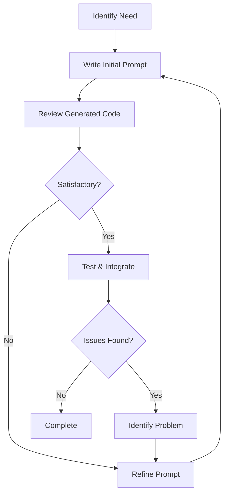
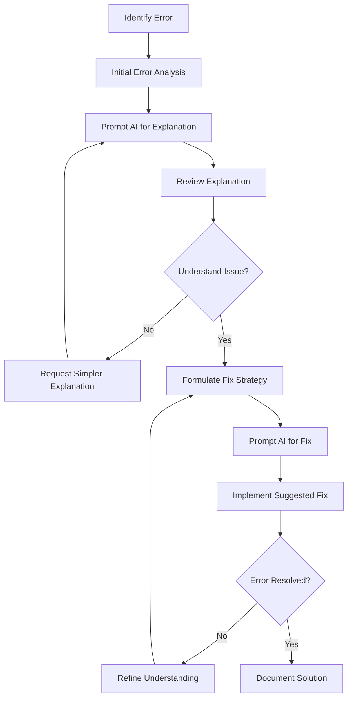
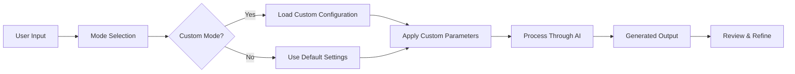
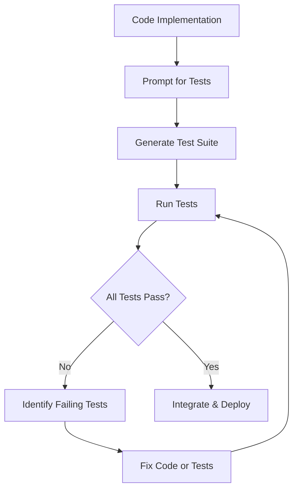
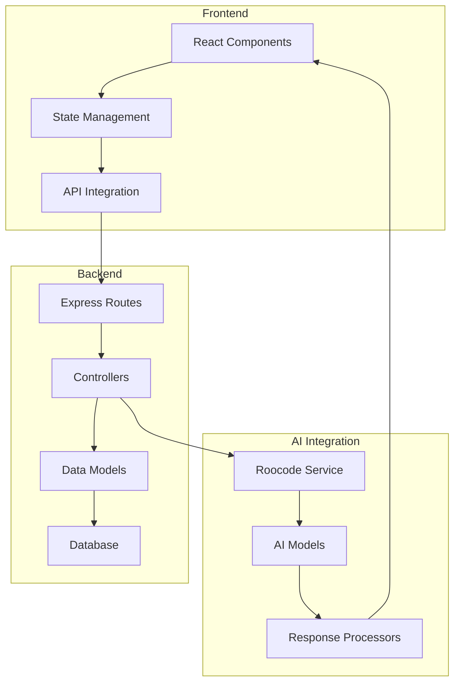

# Visual Elements for Course Enhancement

This document outlines the visual assets needed to enhance the course materials.

## Required Diagrams

### 1. Iterative Development Workflow (Lesson 4)

### 2. Debugging Process Flowchart (Lesson 5)

### 3. Roocode Custom Modes Architecture (Lesson 7)

### 4. Testing Framework Integration (Lesson 8)

### 5. Capstone Project Architecture (Lesson 10)

## Screenshot Requirements

### UI Screenshots Needed

1. **Roocode Main Interface**
   - Annotated with key elements (prompt area, response area, tools)
   - Show key controls and buttons

2. **Custom Mode Configuration Screen**
   - Mode selection dropdown
   - Parameter configuration panel
   - System prompt editor

3. **Debugging Interface**
   - Error display
   - AI suggestion panel
   - Code diff view

4. **Code Generation Examples**
   - Before/after comparison
   - Highlighted changes
   - Comments explaining improvements

5. **Test Results Visualization**
   - Test suite execution output
   - Code coverage report
   - Test case breakdown

## Interactive Elements

### Code Sandboxes
- Embed interactive code examples that students can edit and run
- Include "Reset" button to restore original code
- Provide "Show Solution" option

### Progress Trackers
- Visual progress bar for each lesson
- Completion checkmarks for major sections
- Achievement badges for completed exercises

### Guided Walkthroughs
- Step-by-step tooltips for complex processes
- Animated transitions between steps
- Interactive decision points

## Production Guidelines

1. **Consistency**
   - Use consistent color scheme across all visuals
   - Maintain uniform styling for diagrams
   - Use same annotation style for screenshots

2. **Accessibility**
   - Ensure color contrast meets WCAG standards
   - Provide text alternatives for all diagrams
   - Use clear, readable fonts (min 16px)

3. **Branding**
   - Include Vibecoding/Roocode logo in corner of diagrams
   - Use brand colors in flowcharts
   - Maintain professional appearance 