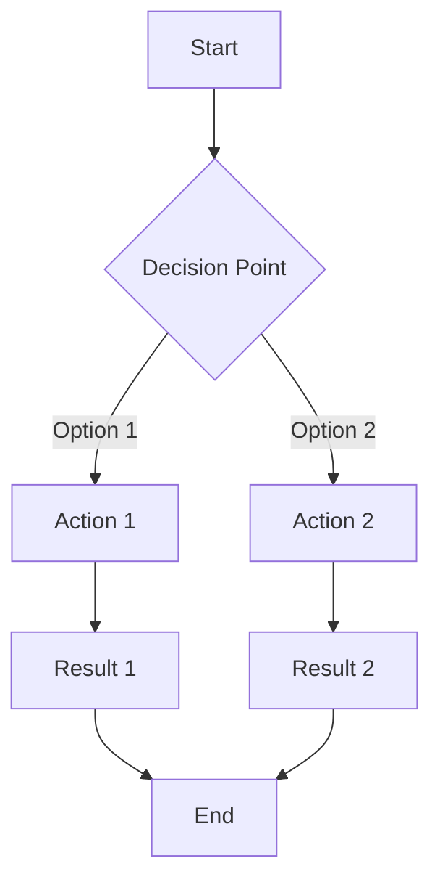
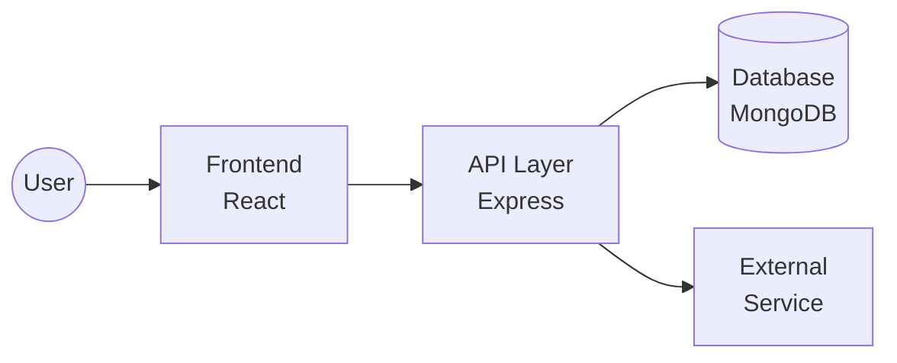
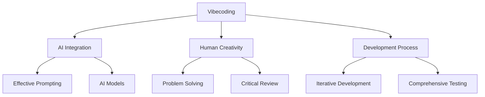
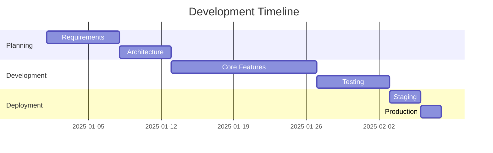
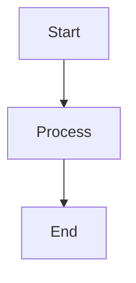
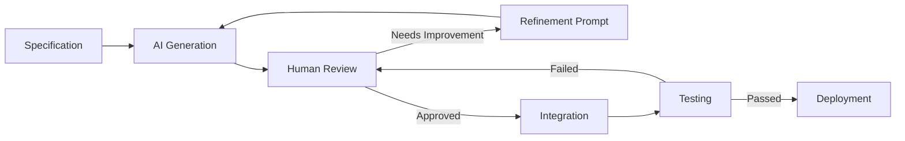
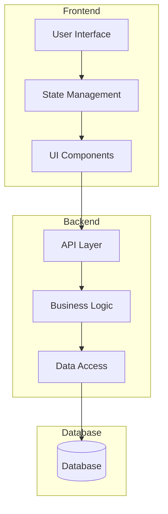

# Visual Elements Guide for Documentation

This guide provides standards and examples for incorporating visual elements into the course documentation. Consistent visual elements improve comprehension, engagement, and overall documentation quality.

## 🎯 Types of Visual Elements

### 1. Process Diagrams

Use process diagrams to illustrate workflows, sequences, and step-by-step procedures.



**When to use:** 
- To illustrate development workflows
- To show decision-making processes
- To visualize algorithms and logic flows

### 2. Architecture Diagrams

Use architecture diagrams to show system components and their relationships.



**When to use:**
- To illustrate system designs
- To show component relationships
- To explain technical architectures

### 3. Concept Maps

Use concept maps to show relationships between ideas and concepts.



**When to use:**
- To introduce complex topics
- To show relationships between concepts
- To provide a high-level overview

### 4. Comparison Tables

Use tables to compare different approaches, tools, or concepts.

| Feature | Approach A | Approach B | Approach C |
|---------|------------|------------|------------|
| Speed   | ⭐⭐⭐     | ⭐⭐       | ⭐⭐⭐⭐   |
| Quality | ⭐⭐       | ⭐⭐⭐⭐   | ⭐⭐       |
| Cost    | ⭐⭐⭐     | ⭐⭐       | ⭐         |
| Ease    | ⭐⭐       | ⭐⭐⭐     | ⭐⭐⭐⭐   |

**When to use:**
- To compare different methods or tools
- To show pros and cons of various approaches
- To highlight feature differences

### 5. Code Annotations

Use code annotations to explain specific parts of code examples.

```python
def process_data(data, options=None):
    # [1] Initialize default options if none provided
    if options is None:
        options = {'verbose': False, 'log': True}
    
    # [2] Validate input data structure
    if not isinstance(data, dict):
        raise TypeError("Data must be a dictionary")
    
    # [3] Process each item according to options
    results = {}
    for key, value in data.items():
        results[key] = transform(value, options)  # [4] Apply transformation
        
        # [5] Log results if enabled
        if options.get('log', False):
            print(f"Processed {key}: {results[key]}")
    
    return results
```

Explanation:
1. We set default options to ensure the function works even without explicit options
2. Type checking helps catch errors early and provides clear feedback
3. We process each item one at a time, maintaining the dictionary structure
4. The transform function applies the actual business logic (defined elsewhere)
5. Optional logging helps with debugging and monitoring

**When to use:**
- To explain complex code examples
- To highlight important concepts in code
- To guide readers through implementation details

### 6. Timeline Graphics

Use timelines to show progression of events, development stages, or learning paths.



**When to use:**
- To illustrate project timelines
- To show learning progression
- To visualize historical developments

## 🎨 Visual Style Guidelines

### Color Scheme

Maintain a consistent color scheme across all visual elements:

- **Primary Color**: #6200EA (Deep Purple)
- **Secondary Color**: #03DAC6 (Teal)
- **Accent Color**: #FF9100 (Orange)
- **Background Colors**: 
  - Light theme: #FFFFFF (White)
  - Dark theme: #121212 (Nearly Black)
- **Text Colors**:
  - Light theme: #212121 (Nearly Black)
  - Dark theme: #E1E1E1 (Nearly White)

### Typography

- **Headings**: Use the same heading hierarchy as the main documentation
- **Labels**: Keep labels concise and descriptive
- **Code Text**: Use monospace font for all code elements

### Size and Placement

- **Width**: Visual elements should not exceed the content width
- **Resolution**: Ensure all elements are crisp and readable at different zoom levels
- **Placement**: Place visuals after the related text, not before it
- **Spacing**: Maintain consistent margins around visual elements

## 🛠️ Implementation Guide

### Adding Mermaid Diagrams

Mermaid diagrams can be added directly in the markdown:

```markdown

```

### Adding Images

Use the following format for images:

```markdown

```

Add captions when helpful:

```markdown
<figure>
  
  <figcaption>Caption explaining the significance of the image</figcaption>
</figure>
```

### Adding Tables

Use markdown tables for simple comparisons:

```markdown
| Header 1 | Header 2 | Header 3 |
|----------|----------|----------|
| Value 1  | Value 2  | Value 3  |
| Value 4  | Value 5  | Value 6  |
```

## 📋 Visual Elements Checklist

Before adding a visual element, ask:

- [ ] Does this visual enhance understanding of the content?
- [ ] Is this the most appropriate type of visual for the concept?
- [ ] Does it follow the style guidelines?
- [ ] Is it accessible and understandable to all users?
- [ ] Does it integrate well with the surrounding text?
- [ ] Is it properly labeled and referenced in the text?

## 🔍 Examples of Effective Visual Elements

### Example 1: Development Workflow

The following diagram illustrates the Vibecoding development workflow:



### Example 2: Component Architecture

This diagram shows a typical architecture for an application built using Vibecoding:



### Example 3: Feature Comparison Table

| Feature | Manual Coding | Vibecoding | Code Templates |
|---------|---------------|------------|----------------|
| Development Speed | ⭐⭐ | ⭐⭐⭐⭐⭐ | ⭐⭐⭐ |
| Customization | ⭐⭐⭐⭐⭐ | ⭐⭐⭐⭐ | ⭐⭐ |
| Learning Curve | ⭐⭐⭐ | ⭐⭐ | ⭐⭐⭐⭐ |
| Maintenance | ⭐⭐ | ⭐⭐⭐⭐ | ⭐⭐⭐ |
| Innovation | ⭐⭐⭐⭐ | ⭐⭐⭐⭐⭐ | ⭐⭐ |